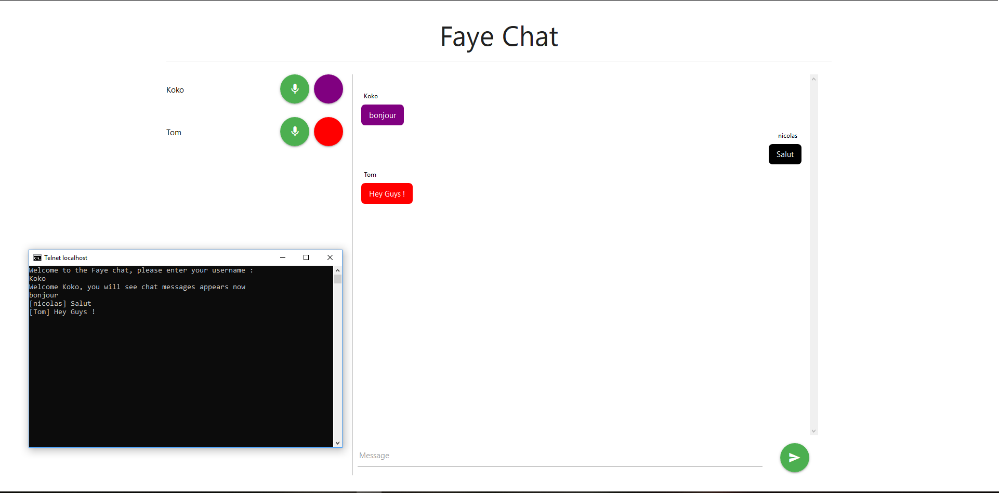

# Faye chat

Here is my functional program for the bitcraft node js exercise.

  

The server is located in the "server" folder.

  

The Client is located in the "src" folder.

  

# Run the project

Open your powershell command prompt to the root folder and run this command :

```./run.ps1```

  

After the command execution has finished, you can access the chat by 2 ways :

|web |https://localhost:8000/ |
|----------|-------------------------------------|
|**telnet**| **host**: localhost / **port**: 9000|

  

# Task

  

|Task |Status |
|----------|------------|
|1-1 |done |
|1-2 |done |
|1-3 |done |
|1-4 |done |
|1-5 |done |
|2-1 |done |
|2-2 |done |
|2-3 |not entirely|

  

*Note* : Concerning "Task #2-3", I'm not sure about my answer. I just make an https server with self-generated ssl certificate. Https only allows secured communications between the web client and the server but I assume he does not work with a telnet client (I tried to scan communications with WireShark but I didn't get information). Telnet client is based on TCP protocol, so I tried to make a TLS server but I got some issues with the socket events (putty client). I can give you more details during the next skype interview.

  

# Preview

  


